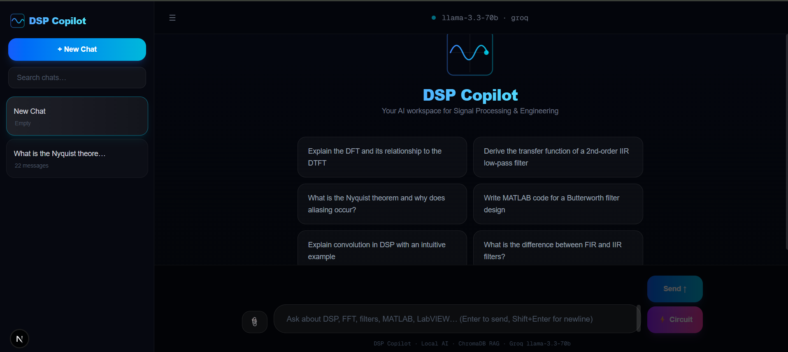
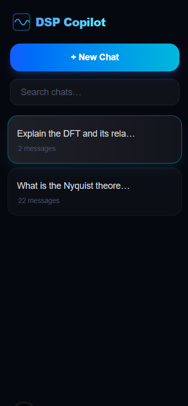
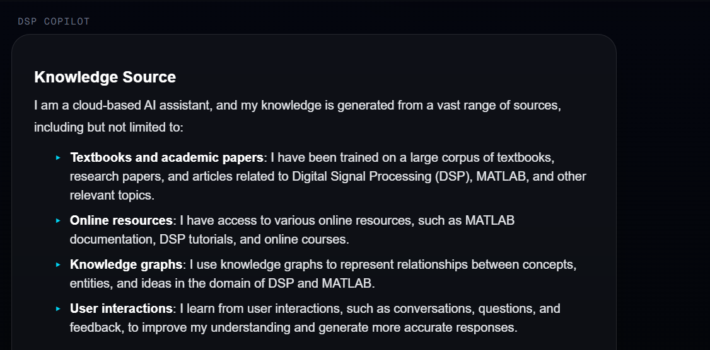

# DSP Copilot


**RAG-powered AI Copilot for Digital Signal Processing, MATLAB, and LabVIEW**

DSP Copilot is a full-stack AI engineering project that combines **Retrieval-Augmented Generation (RAG)**, **Large Language Models (LLMs)**, and a modern web application to create a domain-specific AI assistant for Digital Signal Processing (DSP), MATLAB, and LabVIEW.

Unlike general-purpose AI assistants, DSP Copilot grounds every response using a curated technical knowledge base built from DSP textbooks, MATLAB documentation, LabVIEW resources, and engineering references.

---

# Preview

| Home                 | AI Chat              |
| -------------------- | -------------------- |
|  |  |

| Streaming Response     | RAG Response        |
| ---------------------- | ------------------- |
|  |  |

---

# Overview

The application allows users to ask engineering questions in natural language while retrieving relevant information from an indexed technical document collection before generating responses with a locally hosted LLM.

The project demonstrates the implementation of:

* Retrieval-Augmented Generation (RAG)
* Semantic Search using Vector Embeddings
* ChromaDB Vector Database
* Local LLM inference with Ollama
* FastAPI Backend
* Next.js + React Frontend
* Streaming AI Responses
* Markdown Rendering
* Persistent Chat Sessions


# Features

* AI-powered DSP question answering
* Retrieval-Augmented Generation (RAG)
* ChromaDB semantic vector search
* Local inference using Ollama
* Streaming responses
* Markdown support
* Persistent chat history
* Modern responsive UI
* Modular FastAPI backend
* Next.js frontend

---

# System Architecture

```text
                 User

                   │

                   ▼

          Next.js Frontend

                   │

          HTTP API Request

                   │

                   ▼

          FastAPI Backend

                   │

         Retrieve Documents

                   │

                   ▼

             ChromaDB

                   │

      Relevant Context Chunks

                   │

                   ▼

      Prompt Construction

                   │

                   ▼

      Ollama (Llama Model)

                   │

         Streaming Response

                   │

                   ▼

             Frontend UI
```

---

# Tech Stack

### Frontend

* Next.js
* React
* TypeScript
* Tailwind CSS
* React Markdown

### Backend

* FastAPI
* Python
* Uvicorn

### AI

* Ollama
* LangChain
* ChromaDB
* Sentence Transformers
* RAG Pipeline

### Database

* ChromaDB Vector Database

---

# Project Structure

```text
DSP-COPILOT
│
├── backend
│   ├── docs
│   ├── ingest.py
│   ├── main.py
│   ├── requirements.txt
│   └── .env
│
├── frontend
│   ├── app
│   ├── public
│   ├── package.json
│   └── package-lock.json
│
└── README.md
```

---

# Retrieval-Augmented Generation Workflow

1. User submits a question.
2. The backend generates an embedding for the query.
3. ChromaDB retrieves the most relevant document chunks.
4. Retrieved context is injected into the system prompt.
5. Ollama generates an answer using the retrieved context.
6. The response is streamed back to the frontend.

---

# Installation

## Backend

```bash
cd backend

python -m venv venv

venv\Scripts\activate

pip install -r requirements.txt

uvicorn main:app --reload
```

## Frontend

```bash
cd frontend

npm install

npm run dev
```

---

# Current Capabilities

* DSP concept explanations
* MATLAB assistance
* LabVIEW assistance
* Signal Processing theory
* Retrieval from technical PDFs
* Streaming AI responses

---

# Planned Improvements

* Source citations with page numbers
* Circuit diagram generation
* Bode plot generation
* Pole-zero visualization
* FFT visualization
* PDF upload from UI
* Multi-model support
* Docker deployment
* Authentication
* Cloud deployment

---

# Why I Built This

General-purpose AI assistants often hallucinate or lack depth when answering domain-specific engineering questions.

DSP Copilot was built to explore how Retrieval-Augmented Generation can improve answer quality by grounding responses in trusted engineering references while maintaining the conversational experience of modern LLMs.

The project also served as an opportunity to gain hands-on experience building end-to-end AI systems spanning frontend development, backend APIs, vector databases, prompt engineering, and local LLM deployment.

---

# License

MIT License
